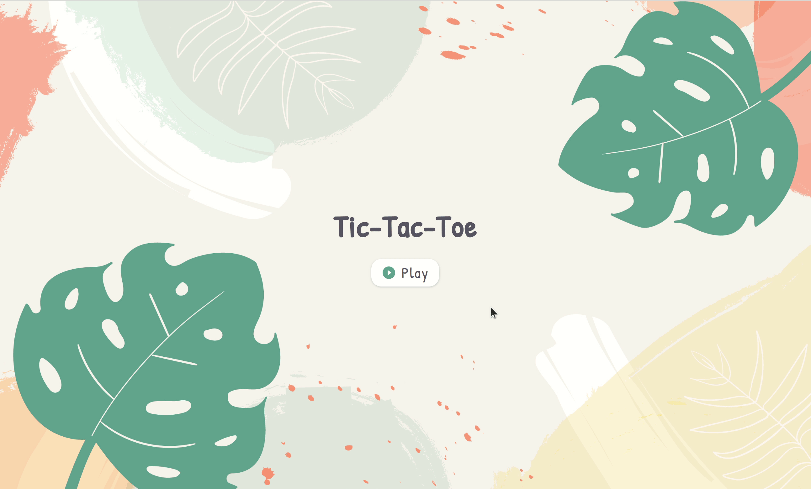
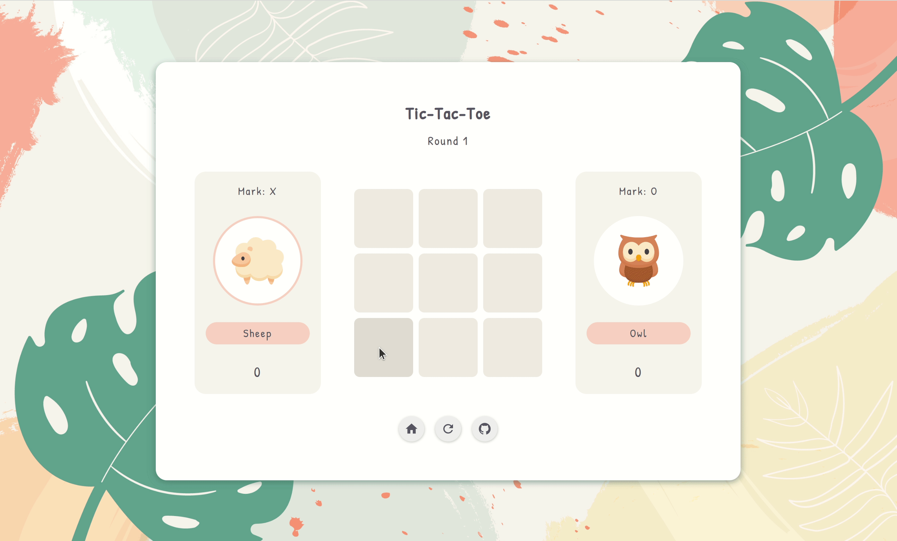

# Tic-Tac-Toe

https://hannahkim313.github.io/tic-tac-toe/

## Project Summary

This project exercise, created by The Odin Project, is a browser version of
the game Tic-Tac-Toe that allows two players to play.

## Note

This project is **not** responsive-friendly, so the game is only accessible
on browsers with larger screens. However, I plan to make it responsive
in the future and will update it here, respectively.

## Goals

* Reduce the amount of global code by using both factory functions and
  the Module Pattern (IIFE)
* Create private functions and variables
* Use inheritance with factories (if necessary)
* Gain a greater understanding of scope and closure

## In Action

### Player Selection

### Game Play

## Reflection

When I first started implementing the functionality portion of this project, I
was unsure of how to incorporate both factory functions and the module pattern
into my code. I was used to creating everything in the global environment, so it
took some time to figure out how to structure my code in a way that kept all
variables and functions private yet accessible at the same time. After
consistently working with them, however, I finally understood *how* and *why*
they work as well as the importance of scope and closures. Factories and modules
also helped me stay organized by separating groups of code with each other,
which was something that was hard to do before without having a lot of comments
involved. Overall, I am quite satisfied with the outcome of this project as I
learned new ways to both improve and protect my code for future projects.

## Credits

* [Background image](https://www.freepik.com/free-vector/tropical-leaves-background-with-pastel-color-stains_18380813.htm#query=background%20pastel&position=41&from_view=search) by [mons.design](https://www.freepik.com/author/mons-design) at Freepik

* [Animal icons](https://www.flaticon.com/packs/animals-54) by [Freepik](https://www.freepik.com/author/freepik) at Flaticon

* [Pencil icon](https://www.flaticon.com/free-icon/pencil_3094216?related_id=3094216&origin=search) by [Freepik](https://www.freepik.com/author/freepik) at Flaticon

* Miscellaneous icons by [Material Design Icons](https://materialdesignicons.com/)